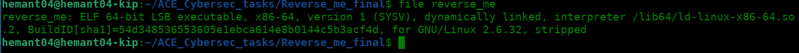
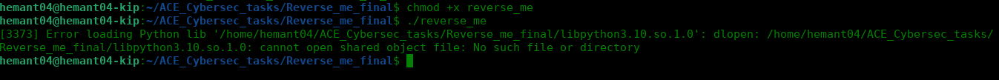
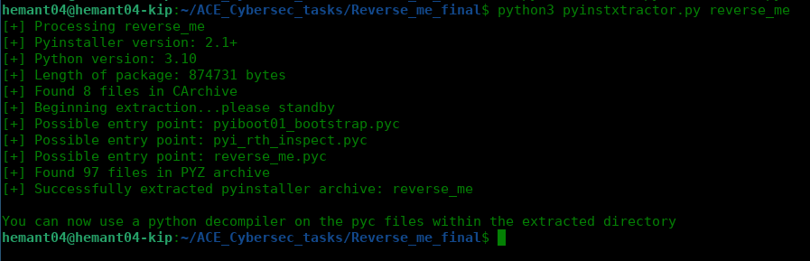
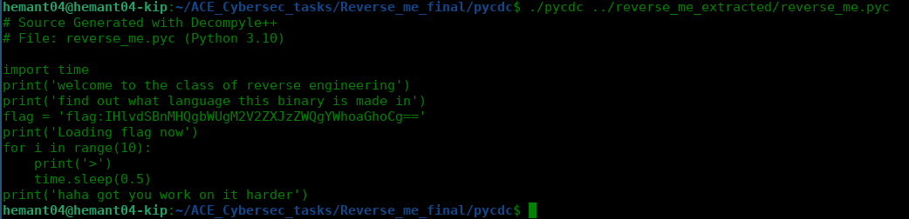
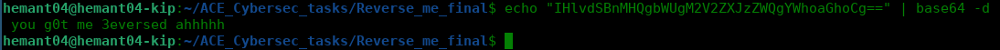

# CyberSecurity Task: Reverse Engineering
*Reverse engineer the given ELF binary and find out the flag inside the code.* 
*Link to the file : https://drive.google.com/drive/folders/15j_HeBuZRjAJw8F5IrbOR1IFb9_NfkV_?usp=share_link* 
*This task was given to me by my mentor Ayan Ambesh.*

In this writeup i will describe my approach reverse engineering the given binary and finding the flag inside the code.

## Step 1:
When you will go to the given link you will see a file named "reverse_me" with no extensions or file type. As said in the task that it is an ELF file which means it is Executable Linux Format and it only can be executed in linux. So I downloaded it and the first thing that came to my mind was to confirm that it is an ELF and which type of ELF it is.  
*So the command i used for that was "file reverse_me"*

After this i simply run the file to see the output of the executable file.  
*Command used: "chmod +x reverse_me" and then "./reverse_me"*

As you can see in the above image that after running the file it gives a error message saying "[3373] Error loading Python lib '/home/hemant04/ACE_Cybersec_tasks/Reverse_me_final/libpython3.10.so.1.0': dlopen: /home/hemant04/ACE_Cybersec_tasks/Reverse_me_final/libpython3.10.so.1.0: cannot open shared object file: No such file or directory". By this error we can clearly see that the file is a python file and it is trying to import a library named "libpython3.10.so.1.0" which is not present in the directory. So we need to find this library and import it in the file.  

## Step 2:
After the first step we know that the ELF is made in python, So we just need to decompile and extract the source code to find the flag.  
After researching how to decompyle python files i found a way that worked for me that is using pyinstxtractor.py. and then pycdc.py. to extract the source code.  
First you have to get the pyinstxtractor.py file from the github repository of pyinstxtractor.  
link: https://github.com/extremecoders-re/pyinstxtractor  
So simply clone the repository and then run the pyinstxtractor.py file.  
*Command used: "python3 pyinstxtractor.py reverse_me"*

This will create a folder named "reverse_me_extracted" which is containing all the pyc files and pyz of the executable file. In that folder we will see a reverse_me.pyc file which is the main pyc which we will decompile to get the source code using a decompliler pycdc.py.  

## Step 3:
Now we have to get the pycdc.py file from the github repository of pycdc.  
link: https://github.com/zrax/pycdc  
So simply clone the repository and move the pycdc executable file to the folder where the reverse_me.pyc file is present.  
As the pycdc file in this repository is not executable and made in c++ so we have to compile it first. I found a easy method to do so using cmake and make commands.  
*Commands used: "cmake ." and then "make" and then "make check"*
As these commands exectution is output is to long for a screenshot simply execute them in this order and it should fine. 
<code>git clone https://github.com/zrax/pycdc.git </code> 
<code>cmake . </code> 
<code>make </code> 
<code>make check </code> 

After this you will have pycdc executable in pycdc folder.  
Now you have to just run the pycdc file wth the path to the reverse_me.pyc file.  
*Command used: "./pycdc ../reverse_me_extracted/reverse_me.pyc"*

Here the flag is written but encrypted. So we have to decrypt it to get the flag.  

## Step 4:
So after decompiling the elf we got the encrypted flag "IHlvdSBnMHQgbWUgM2V2ZXJzZWQgYWhoaGhoCg==" which is clearly a base64 encoded string. So we have to decode it to get the flag.  

*Command used: "echo "IHlvdSBnMHQgbWUgM2V2ZXJzZWQgYWhoaGhoCg==" | base64 -d"*

Finally we got the flag "You got me 3versed ahhhh"  
