# RootMe -- Tryhackme Writeup
*This writeup explains the RootMe tryhackme room made by @reddyyZ and my approach of doing the task given in the room. https://tryhackme.com/room/rrootme*

## Task One ( Deploy the machine ) :
Connect to TryHackMe network and deploy the machine. If you don't know how to do this, complete the OpenVPN room first. In this basically you have to download your openvpn configuration file from Access option in dropdown when you click your profile photo in the upper righy conner it also explains the steps to connect openvpn and then connect to Tryhackme network and then deploy the machine.h 

## Task Two ( Reconnaissance ) :
In this task we have to gather information about the target and answer the questions below. So the tool to do reconnaissance is nmap. we will use two flags to with nmap command to decrease time consumption and gather specific information about the target. 
*Command: nmap -sC -sV  10.10.38.187* 
-sC flag is used to run default scripts for nmap and -sV flag is used to pull version information from the target. 
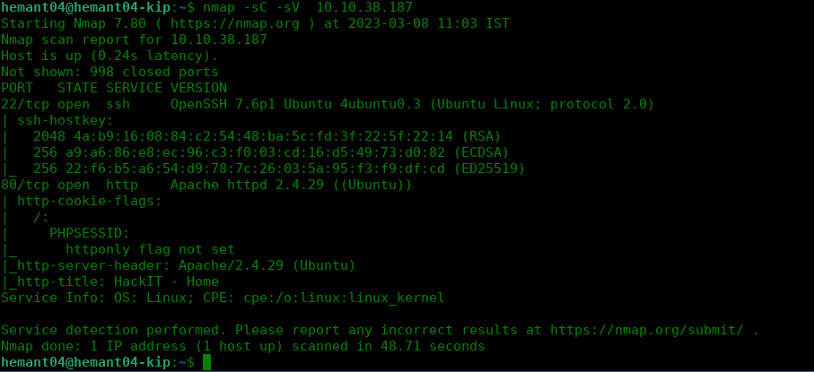
>### Question 1: Scan the machine, how many ports are open?
>*Ans 1: 2*
>### Question 2: What version of Apache is running?
>*Ans 2: 2.4.29*
>### Question 3: What service is running on port 22?
>*Ans 3: ssh*
>### Question 4: Find directories on the web server using the GoBuster tool.
>For this question we have to use gobuster tool to find directories on the web server. We will use the command given below to find directories on the web server. 
>Command: gobuster dir -u http://10.10.26.159/ -w /usr/share/wordlists/dirb/common.txt 
>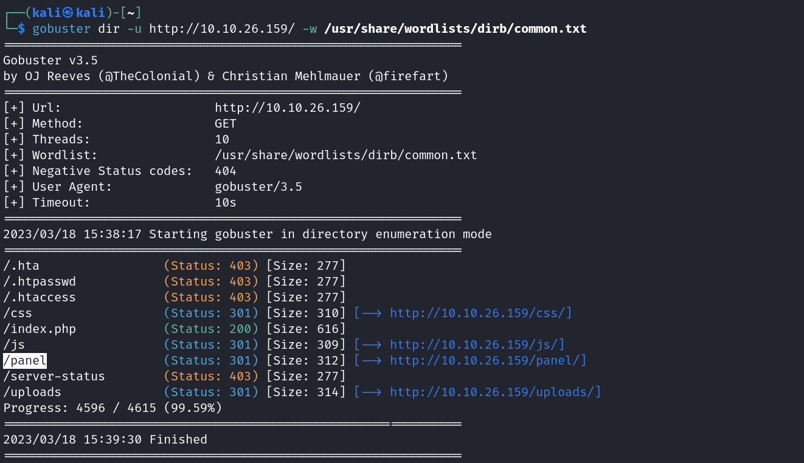
>### Question 5: What is the hidden directory?
>*Ans 5: /panel/*
## Task 3 ( Getting a shell ):
In this task we have to find a form to upload and get a reverse shell, and find the flag. 
So as we know that /panel/ directory is hidden so we go to that in our web browser. 
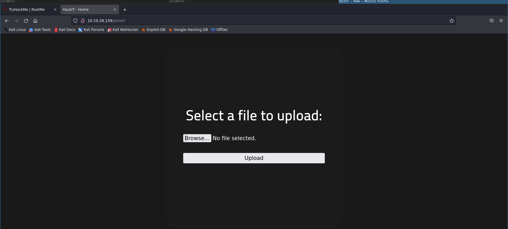
As we found the form to upload a file now we have to find a reverse shell to upload. As in kali linux there are already reverse shells in /usr/share/webshells/ directory so we will use that. As in gobuster command we saw that a php file was already in place that is index.php we know that we have to try php reverse shells so we will use php-reverse-shell.php file from /usr/share/webshells/ directory and try to upload it. 
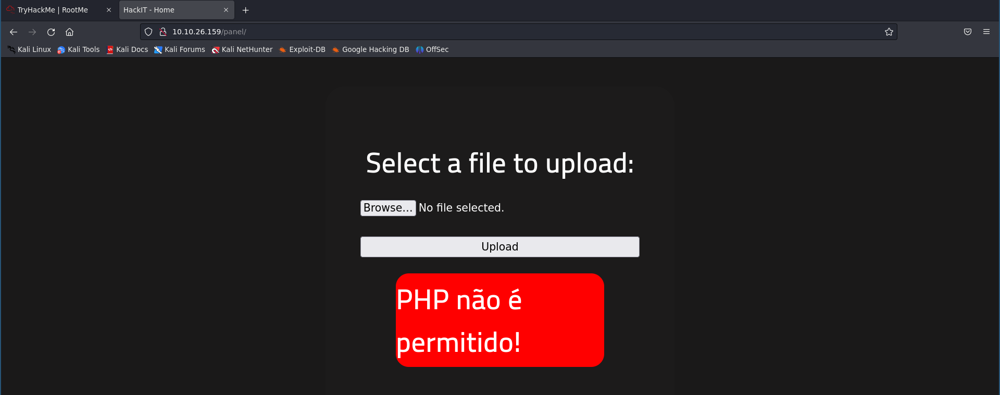
As you can see it generates an error which translates to PHP is not allowed!. So we have to change the extension of the file to variants of php i.e php3,ph4,php5,php2,phtml. From these variants only phtml works. simply rename your file to php-reverse-shell.phtml and open it to see which port is written. In my case it is 9999.Also change the ip in in the phtml file to the ip given by tryhackme in the upper right green box on tryhackme site, basically your openvpn ip. After upload the file. 
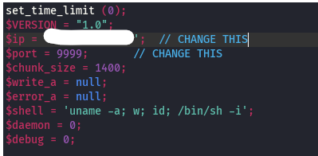
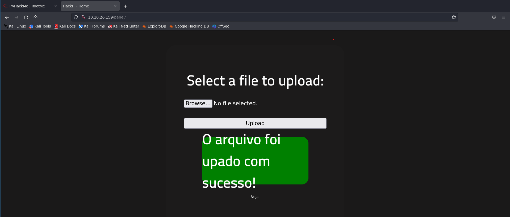
As you can see the file is uploaded and the message translates to "The file has been successfully uploaded!" and we have a reverse shell. Now we have to start a listener on our kali machine to get the reverse shell. To do this we will use netcat command. 
We can see our upload at http://10.10.26.159/uploads 
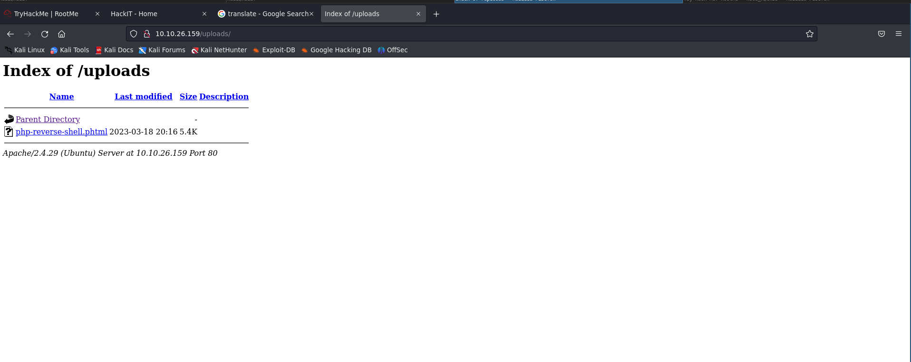
Now we have to start a listener on our kali machine to get the reverse shell. To do this we will use netcat command. 
Command: nc -lvnp 9999 
and also start a curl command to get the execute the file and get the reverse shell 
Command: curl http://10.10.26.159/uploads/"php_file_name"/ 
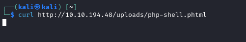
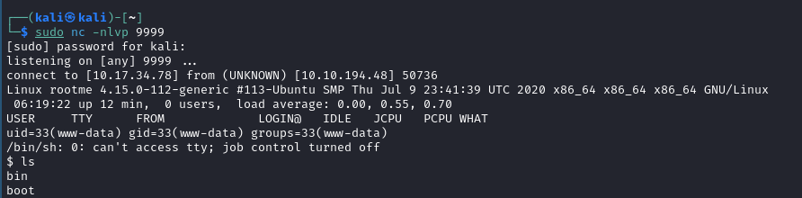 
After this you will have the reverse shell you now need to find the user.txt which contains the file. 
Command to find the file is : find / -type f -name user.txt 2>/dev/null 
<ul><li>type f – you are telling find to look exclusively for files</li>
<li>-name user.txt – instructing the find command to search for a file with the name “user.txt”</li>
<li>2> /dev/null – so error messages do not show up as part of the search result</li></ul> 

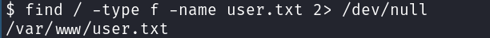
As we can see the file is in /var/www/user.txt simply cat the file to get the flag. 

>### Question 1:  user.txt 
>### Ans 1:THM{y0u_g0t_a_sh3ll}

## Task 4 ( Privilege escalation ):
Now that we have a shell, let's escalate our privileges to root. 
In this task we have to find a way to escalate our privileges to root and find the flag. 
>### Question 1: Search for files with SUID permission, which file is weird?
In this we have to list the files with suid permissions and find out which file should not have suid permissions. 
command to list suid files: find / -perm -u=s -type f 2>/dev/null 
In the list you will find /usr/bin/python has suid permissions but python  don't need suid permissions to run. 
>### Ans 1: /usr/bin/python
 

>### Question 2: Find a form to escalate your privileges.
Now we have to find a way to escalate these privileges using GTFObins. 
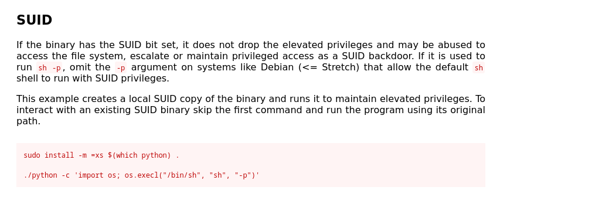 
As we can see from gtfobins we have to execute python with suid permissions and then import os and then os.system("/bin/sh") to get a shell. 
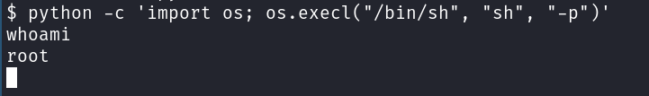 
We Successfully escalated our priveleges now we are root. 
>### Question 3: root.txt
now we have to find root.txt file to get the flag. 
command: find / -type f -name root.txt 2>/dev/null 
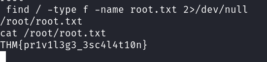 
> ### Ans 2: THM{pr1v1l3g3_3sc4l4t10n}
 
